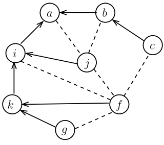
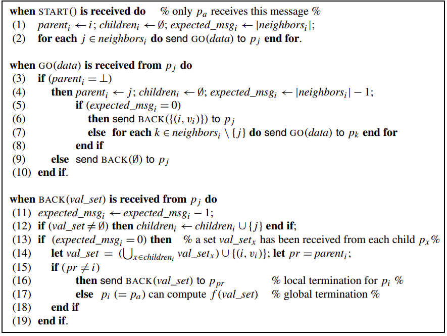

## Parallel Traversal: Broadcast and Convergecast  
It is assumed that, while the identity of a process **p<sub>i</sub>** is its index **i**, no process knows explicitly the value of **n**(i.e., **p<sub>n</sub>** knows that its identity is **n**, but does not know that its identity is also the number of processes).  
  
### Broadcast and Convergecast  
Two frequent problems encountered in distributed computing are *broadcast* and *convergecast*. These two problems are defined with respect to a distinguished process **p<sub>a</sub>**.  

* The *broadcast* problem is a one-to-many communication problem. It consists in designing an algorithm that allows the distinguished process **p<sub>a</sub>** to disseminate information to the whole set of processes.  
  
* The *convergecast* problem is a many-to-one communication problem. It consists in designing an algorithm that allows each process **p<sub>j</sub>** to send information **v<sub>j</sub>** to a distinguished process **p<sub>a</sub>** for it to compute some function **f()**, which is on a vector **[v1,...,vn]** containing one value per process.  
  
*Broadcast* and *convergecast* can be seen as dual communication operations. They are usually used as a pair: **p<sub>a</sub>** broadcasts a query to obtain values, one from each process, from which it computes the resulting value **f()**.  
  
As a simple example that we will implement: 
**p<sub>a</sub>** is a process that queries sensors for temperature values, and final out all the values.  
  
### Broadcast/Convergecast Based on a Rooted Spanning Tree  
A rooted spanning tree:  
  
  
#### Rooted Spanning Tree  
A spanning tree rooted at **p<sub>a</sub>** is a tree which contains **N** processes and whose channels(edges) are channels of the communication graph. Each process **p<sub>i</sub>** has a single parent, locally denoted **parent<sub>i</sub>**, and a(possibly empty) set of children, locally denoted **children<sub>i</sub>**. To simplify the notation, the parent of the root is the root itself, i.e., the distinguished process **p<sub>a</sub>** is the only process **p<sub>i</sub>** such that **parent<sub>i</sub>** = i. Moreover, if j != a, we have j ∈ **children<sub>i</sub>** => **parent<sub>j</sub>** = i, and the channel **<i,j>**  belongs to the communication graph.  
An example of a rooted spanning tree is described above. The arrows (oriented toward the root) describe the channels of the communication graph that belong
to the spanning tree. The dotted edges are the channels of the communication graph that do not belong to the spanning tree. This spanning tree rooted at **p<sub>a</sub>** is such that, when considering the position of process **p<sub>i</sub>** where **neighbors<sub>i</sub>** = {a,k,j,f }, we have **parent<sub>i</sub>** = a, **children<sub>i</sub>*** = {j,k} and consequently **parent<sub>j</sub>** = **parent<sub>k</sub>** = i. Moreover, **children<sub>i</sub>** ∪ {**parent<sub>i</sub>**} ⊆ **neighbors<sub>i</sub>** = {a,k,j,f }.  
  
#### Building a Spanning Tree  
This algorithm is sometimes called *propagation of information with feedback*. Once a spanning tree has been constructed, it can be used for future broadcasts and convergecasts involving the same distinguished process **p<sub>a</sub>**.  
  
#### Local Variables  
As before, each process **p<sub>i</sub>** is provided with a set **neighbors<sub>i</sub>** which defines its position in the communication graph and, at the end of the execution, its local variables **parent<sub>i</sub>** and **children<sub>i<sub>** will define its position in the spanning tree rooted at **p<sub>a</sub>**. To compute its position in the spanning tree rooted at **p<sub>a</sub>**, each process **p<sub>i</sub>** uses an auxiliary integer local variable denoted **expected_msg<sub>i</sub>**. This variable contains the number of messages that **p<sub>i</sub>** is waiting for from its children before sending a
message **BACK()** to its parent.  
  
#### Algorithm
  
The broadcast/convergecast algorithm building a spanning tree is described above. To simplify the presentation, it is first assumed that the channels
are **FIFO** (first in, first out, **but our later implementation is Non-FIFO Channels**). The distinguished process **p<sub>a</sub>** is the only process which
receives the external message **START()**(line 1). Upon its reception, **p<sub>a</sub>** initializes **parent<sub>a</sub>**, **children<sub>a</sub>** and **expected_msg<sub>a</sub>** and sends a message **GO(data)** to each of its neighbors (line 2). When a process **p<sub>i</sub>** receives a message **GO(data)** for the first time, it defines the sender **p<sub>j</sub>** as its parent in the spanning tree, and initializes **children<sub>i</sub>** to ∅ and
**expected_msg<sub>i</sub>** the number of its neighbors minus **p<sub>j</sub>**(line 4). If its parent is its only neighbor, it sends back the pair **<i,v<sub>i</sub>>** thereby indicating to **p<sub>j</sub>** that it is one of its children(lines 5–6). Otherwise, **p<sub>i</sub>** forwards the message **GO(data)** to all its neighbors but its parent **p<sub>j</sub>**(line 7). If **parent<sub>i</sub>** != ⊥, when **p<sub>i</sub>** receives **GO(data)**, it has already determined its parent in the spanning tree and forwarded the message **GO(data)**. It consequently sends by return to **p<sub>j</sub>** the message **BACK(∅)**, where ∅ is used to indicate to **p<sub>j</sub>** that **p<sub>i</sub>** is not one of its children(line 9). When a process **p<sub>i</sub>** receives a message **BACK(res, val_set)** from a neighbor **p<sub>j</sub>** , it decreases **expected_msg<sub>i</sub>**(line 11) and adds **p<sub>j</sub>** to **children<sub>i</sub>** if val_set != ∅(line 12). Then, if **p<sub>i</sub>** has received a message **BACK()** from all its neighbors (but its parent, line 13), it sends to its parent(lines 15–16) the set **val_set** containing its own **pair(i,v<sub>i</sub>)** plus all the **pairs(k,v<sub>k</sub>)** it has received from its children(line 14). Then, **p<sub>i</sub>** has terminated its participation in the algorithm (its local variable **expected_msg<sub>i</sub>**
then becomes useless). If **p<sub>i</sub>** is the distinguished process **p<sub>a</sub>**, the set val_set contains a **pair(x,v<sub>x</sub>)** per process **p<sub>x</sub>**, and **p<sub>a</sub>** can accordingly compute f(val_set)(where f() is the function whose result is the output of the computation). Let us notice that, when the distinguished process **p<sub>a</sub>** discovers that the algorithm has terminated, all the messages sent by the algorithm have been received and processed.  
  
### Implementation 
For example:   
```mermaid
graph LR;

        GZ((:1024,GuangZhou)) --- ZZ((:1025,ZhenZhou))
        ZZ((:1025,ZhenZhou)) --- BJ((:1026,BeiJing))
        SZ((:1027,ShenZhen)) --- GZ((:1024,GuangZhou))
        SZ((:1027,ShenZhen)) --- ZZ((:1025,ZhenZhou))
        ZZ((:1025,ZhenZhou)) --- XJ((:1028,XinJiang))
        WH((:1029,WuHan)) --- ZZ((:1025,ZhenZhou))
        WH((:1029,WuHan)) --- SZ((:1027,ShenZhen))
        WH((:1029,WuHan)) --- GZ((:1024,GuangZhou))
```  
```bash  
#One possible output:
#XinJiang[localhost:1028] is launched right now...
#BeiJing[localhost:1026] is launched right now...
#WuHan[localhost:1029] is launched right now...
#ShenZhen[localhost:1027] is launched right now...
#GuangZhou[localhost:1024] is launched right now...
#ZhenZhou[localhost:1025] is launched right now...
#-------------------------------
#BeiJing: 7°C
#XinJiang: 2°C
#ShenZhen: 4°C
#GuangZhou: 32°C
#WuHan: 32°C
#ZhenZhou: 18°C
-------------------------------
$ ./At BeiJing
```  
### Advance  
1. **A Spanning Tree per Process**  
My implementation above can be easily generalized to build **N** trees, each one associated with a distinct process which is its distinguished process. Then, when any process **p<sub>i</sub>** wants to execute an efficient broadcast/convergecast, it has to use its associated spanning tree. To build a spanning tree per process, the local variables **parent<sub>i</sub>**, **children<sub>i</sub>**, and **expected_msg<sub>i</sub>** of each process **p<sub>i</sub>** have to be replaced by the arrays **parent<sub>i</sub>[1..n]**, **children<sub>i</sub>[1..n]** and **expected_msg<sub>i</sub>[1..n]** and all messages have to carry the identity of the corresponding distinguished process. More precisely, when a process **p<sub>k</sub>** receives a message **START()**, it uses its local variables **parent<sub>k</sub>[k]**, **children<sub>k</sub>[k]**, and **expected_msg<sub>k</sub>[k]**. The corresponding messages will carry the identity **k**, **GO(k,−)** and **BACK(k,−)**, and, when a process **p<sub>i</sub>** receives such messages, it will uses its local variables **parent<sub>i</sub>[k]**, **children<sub>i</sub>[k]** and **expected_msg<sub>i</sub>[k]**.  
  
2. **Concurrent Initiators for a Single Spanning Tree**  
The implementation above can be easily modified to build a single spanning tree while allowing several processes to independently start the execution of the algorithm, each receiving initially a message **START()**. To that end, each process manages an additional local variable **max_id<sub>i</sub>**
initialized to 0, which contains the highest identity of a process competing to be the root of the spanning tree.  
* If a process **p<sub>i</sub>** receives a message **START()** while **max_id<sub>i</sub>** != 0, **p<sub>i</sub>** discards this message(in that case, it already participates in the algorithm but does not compete to be the root). Otherwise, **p<sub>i</sub>** starts executing the algorithm and all the corresponding messages **GO()** or **BACK()** carry its identity.  
* Then, when a process **p<sub>i</sub>** receives a message **GO(j,−)**, **p<sub>i</sub>** discards the message if
j < **max_id<sub>i</sub>**. Otherwise, **p<sub>i</sub>** considers **p<sub>j</sub>** as the process with the highest identity which is competing to be the root. It sets consequently **max_id<sub>i</sub>** to **j** and continues executing the algorithm by using messages **GO()** and **BACK()** carrying the identity **j**.